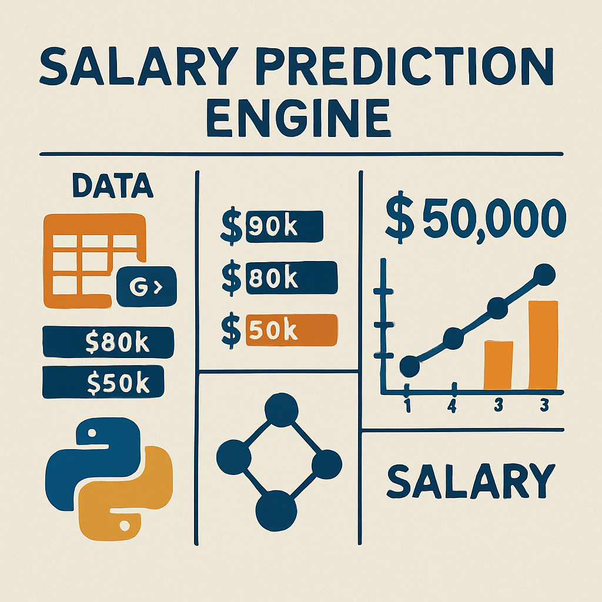

# 💼 Employee Salary Prediction using Machine Learning 

# Summary
Using Machine Learning Algorithms classifing the employees under <=50K or >50K salary bracket.

# Overview
Creating a free web service machine learning salary prediction engine which can help HR team to classify the employees under category of
<=50K & >50K salary by looking into some features.

## 🛠️ Problem Statement
Building a **salary prediction engine using Machine Learning** to assist the 
**HR Department** in predicting whether an employee earns **> $50K or <= $50K**,
aiding data-driven and fair compensation decisions.

---

## 💻 IDE Used
- **Google Colab** with **T4 GPU** for efficient model training.

---

## 🧩 Libraries and Modules Used
- **Pandas, NumPy** – Data manipulation and analysis
- **Scikit-Learn** – Preprocessing, model building, evaluation
- **Streamlit** – App interface for deployment
- **Ngrok, Pyngrok** – API gateway and free deployment

---

## 📂 Dataset
- The dataset is available in the repo as: **`adult 3.csv`**

---

## 🚀 Workflow of the Process

1️⃣ **Import Libraries**  
NumPy, Pandas, Matplotlib, Seaborn, Scikit-Learn for data handling and ML.

2️⃣ **Load Dataset**  
Load CSV data using Pandas.

3️⃣ **EDA & Cleaning**  
- Checked null and duplicate values (removed 52 duplicates).
- Handled `'?'` missing values in *occupation*, *workclass*, and *education*.

4️⃣ **Feature Selection**  
Selected real-life salary impact features:
- `age`, `workclass`, `education`, `occupation`, `hours-per-week`, `native-country`, `income`.

5️⃣ **Outlier & Categorical Analysis**  
- Boxplot for age (range 18–78 years).  
- Countplot to clean low-impact education categories.

6️⃣ **Data Preparation**  
- Split data into features & target (`income`).  
- Label Encoding for categorical variables.  
- Train-test split using Scikit-Learn.

7️⃣ **Model Building**  
- Trial model: Logistic Regression (**accuracy: 74.56%**).  
- Tested models: Random Forest, SVM, KNN, Gradient Boosting.  
- **GradientBoostingClassifier achieved 80% accuracy.**

8️⃣ **Deployment**  
- Built a **Streamlit app** with sliders & dropdowns for predictions.  
- Added batch prediction via CSV upload.  
- Used **Ngrok & Pyngrok** for API gateway and free web deployment.

---

## 📁 Repo Files

| S.No | Folder -->> File                                                       | Description                                         |
|------|------------------------------------------------------------------------|-----------------------------------------------------|
| 1️⃣   | data -->> `adult 3.csv`                                                | Dataset                                            |
| 2️⃣   | model -->> `best_model.pkl`                                            | Trained best Gradient Boosting model               |
| 3️⃣   | scripts -->> `app.py`                                                  | Streamlit app file for deployment                  |
| 4️⃣   | notebooks -->> `SALARY PREDICTION ENGINE USING PYTHON AND ML.ipynb`    | Jupyter notebook with code and analysis            |
| 5️⃣   | images -->> `images/`                                                  | Folder containing related images for documentation |
| 6️⃣   | reports `SALARY PREDICTION ENGINE USING PYTHON AND ML.pdf`             | Notebook exported as PDF for reference             |

---

## 📸 Sample Project Image

